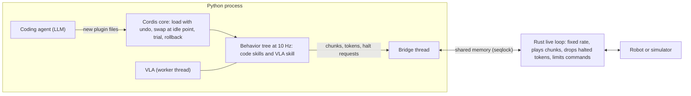

# Repair Without Stopping

A runtime for robot programs that mix code skills with a vision-language-action (VLA) model. A coding agent can replace skills in it while the robot runs. The robot never stops for a restart. A bad replacement is rolled back, and anything it already sent to the arm is cancelled.

This is the code for the AAAI-27 student abstract *Repair Without Stopping: A Runtime for Online Evolution of Hybrid Code–VLA Robot Programs* (Chukwuemeka Samuel Udoh, Ashesi University).

## The problem

Coding agents can write robot programs as readable skills. VLA models handle the contact-rich steps that code does poorly. Once such a program is deployed, fixing a skill usually means restarting it. On a robot that runs its VLA on its own computer, a restart also reloads the model weights, which takes about 20 s on our CPU.

We want an online improvement loop instead. While the task runs, each repair is tried, then kept or rolled back. The program improves without a human in the loop, and the robot keeps a steady control rate the whole time.

## System design



Two processes share memory. Neither ever waits for the other.

**Rust live loop.** It runs at a fixed rate and plays one action per tick. Commands arrive as *chunks*: short lists of up to 50 actions, each stamped with the tick at which its first action should play. The loop does the following:
- skips actions whose tick has passed;
- lets a new chunk replace what is left of the old one;
- holds the arm when no action is due;
- rejects chunks with non-finite values;
- caps speed and acceleration.

If Python's heartbeat stops, Rust plays at most 10 more actions and then holds. Python cannot hold a fixed rate: a VLA call or a single call that holds Python's global lock can freeze every Python thread for seconds. That is why this loop is in Rust. Code: `rust/src/main.rs` (kinematic simulator), `rust/src/bin/live_mj.rs` (MuJoCo SO-101), `rust/src/bin/live_lib.rs` (LIBERO).

**Ownership and halts.** One skill drives the arm at a time. Each time a skill starts driving, it gets a new *token*, which is stamped on its chunks. To stop a skill, Python asks Rust to halt its token. Rust then drops every waiting or playing chunk with that token or an older one, and confirms the halt at its next tick. The runtime requests the halt, not the skill itself. It does so when a skill is replaced, throws an error, runs longer than 0.5 s in one call, or breaks a safety rule. Code: `py/rtvla/services.py`, `py/rtvla/bridge.py`, `py/rtvla/tree.py`.

**Repairs that can be undone.** Skills are plugins. Following Cordis (revertible effects), each step a plugin takes while loading comes with a matching undo, such as registering a skill. If loading crashes, the undos run newest-first. A repair loads beside the old version and takes over only at an idle moment. That means the old version is not running, none of its chunks are waiting or playing, and no VLA call is in flight. The repair is kept only if its trial succeeds; otherwise the old version comes back. Code: `py/rtvla/cordis.py`, `py/rtvla/runtime.py`.

**Behavior tree.** The task is a behavior tree that Python steps at 10 Hz. Each leaf looks up the live version of its skill by name, so a repair never restarts the tree. Code: `py/rtvla/tree.py`, skills in `py/nodes/`.

## Repository layout

```
rust/            Rust live loops (kinematic, MuJoCo SO-101, LIBERO)
py/rtvla/        Python runtime: bridge, Cordis core, tree, services, shared-memory layout
py/nodes/        skill plugins: working skills, planted bugs, faulty repairs used in tests
sim/mujoco/      MuJoCo SO-101 scene, plant process, inverse-kinematics adapter
sim/libero/      LIBERO kitchen scenario: plant, real SmolVLA wrapper, agent runtime, skill library for the agent
experiments/     scripts for every experiment in the paper and supplement
results/         summaries and logs (small files only): kinematic, mujoco, libero
paper/           abstract and supplement (LaTeX and PDF)
layout.json      shared-memory layout (generated by py/rtvla/layout.py)
```

## Experiments and results

All results are in simulation.

- **Kinematic simulator, scripted VLA stand-in** (`experiments/t*.py`, `e*.py`; results in `results/kinematic`):
  - Python stalls of up to 2.7 s: Rust kept commanding on time.
  - 80 broken repairs: all rejected or rolled back.
  - A live fix took over in 198 ms. A restart with SmolVLA loaded took about 20 s.
  - An LLM (DeepSeek-V4.1-Flash) fixed 5 planted bugs × 5 sessions: its first answer was kept every time.
- **MuJoCo SO-101** (`experiments/mj_*.py`; results in `results/mujoco`):
  - One continuous run with a live fix, then two injected bad repairs, both rolled back.
  - A halt enforced in Rust prevented contact with a bowl in 10 of 10 runs. With no halt, or a halt only in Python, the arm hit the bowl in 10 of 10.
- **LIBERO kitchen with the real SmolVLA and an LLM agent** (`sim/libero/`; results in `results/libero`):
  - The agent gets one high-level goal. It plans the task, writes its own skills, and revises them from reports.
  - Over 150 minutes the runtime loaded 21 program versions live, rolled back 18, and never restarted.
  - The agent put the bowl on the stove. The VLA failed at the other goals.
  - The logs include the agent's full reasoning.

The paper and the supplement give the details (`paper/`).

## Running

We used Linux, two CPU cores and no GPU.

```bash
# Rust loops
cd rust && cargo build --release && cd ..
# Python (runtime + MuJoCo)
pip install numpy mujoco matplotlib
python3 py/rtvla/layout.py                  # writes layout.json
python3 experiments/mj_runtime.py 5         # 5 pick-and-place episodes on the MuJoCo SO-101
# LIBERO + real SmolVLA + agent (needs lerobot[smolvla,libero] and DEEPSEEK_API_KEY)
python3 sim/libero/agent_rt.py results/libero/myrun --minutes 60
python3 sim/libero/annotate.py results/libero/myrun   # captioned video of the run
```

## Limitations

- These are simulations with a scripted VLA stand-in, plus the real SmolVLA in LIBERO. They test the runtime mechanisms, not how reliably a task succeeds.
- The bugs were planted.
- The safety checks read exact distances from the simulator. On a real robot these must come from perception.
- The next step is a real SO-101 arm.

## Credits

- The SO-101 model files in `sim/mujoco/assets` come from MuJoCo Menagerie (TheRobotStudio SO-ARM101), under its Apache-2.0 license.
- LIBERO and SmolVLA (`HuggingFaceVLA/smolvla_libero`) are used through LeRobot.
- Cordis: Shi, Zhang and Cui (2026), *A Programming Paradigm for Spatiotemporal Composability*, arXiv:2608.25512.

## License

MIT (see `LICENSE`), except third-party assets, which keep their own licenses.
